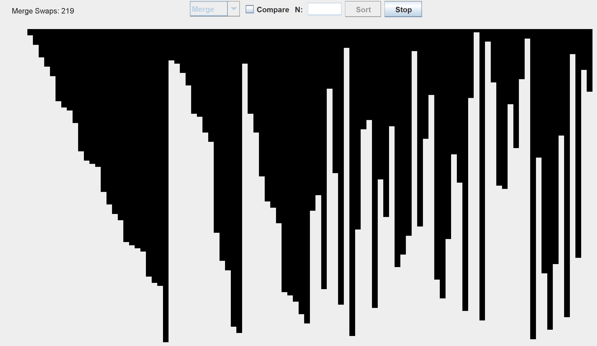
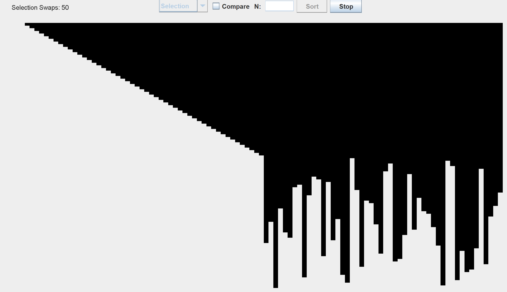

# Sorting-Algorithms
Java GUI that allows the user to specify the algorithm and the size of the array to sort. Can also compare each algorith by ticking the 'compare' box. This will keep the array the same for each algorithm and the user can see the differences in the amount of swaps, animations, and the amount of time taken.

## Instructions
Run window.java\
Choose the algorithm you want to see and click sort\
Change the size of array, by typing an number in text field\
Click stop if you want to\
Click compare if you want to keep arrays the same for each algorithm so you can compare\
For radix and counting sort, red bars means that element was accessed. I added this because otherwise, it wouldn’t be clear what the algorithm was doing, and it would just somewhat instantly sort the array.

## Counting Sort
Essentially counting sort takes in values to be sorted and count the occurrences in an auxiliary array with the index corresponding to the actual value. The size of the auxiliary depends on the range, or highest value of the array.\
For it to do that, it iterates through the array, (n), and fills up the auxiliary array with the number of occurrences of the values
Then, it loops through the auxiliary array, (range), and updates the array, essentially sorting it, using the count and the index of the auxiliary array.\
Thus, the time complexity is just O(n + range), with range being the range of the values in the array. For example, if the values are just from 1 – 100, the range/size of the auxiliary array is just 100.
 

## Radix Sort
Radix sort sorts digit by digit starting from the least significant digit. It’s similar to counting sort but is more for larger numbers.
It essentially does counting sort but for each digit of the values.\
So, it would be O(#digits * (n + range)). But in this case, the range would just be 10, because the digits can only be from 0 – 9.\
The #digits depends on the maximum value in the array, which is just log(max)\
Thus, the time complexity is just O(log(max)*(n+10)) which can just be simplified to O(nlog(max)).
 

## Heap Sort
First build a max heap from the elements in the array using heapify\
Then swap the root with the last element and then heapify again but excluding the last element\
Heapify takes O(log n) but since it’s doing heapify for each element in the array, O(n), Heap sort takes O(nlogn)\
The best, worst, and average case are the same – O(nlogn)

## Quick Sort
A divide and conquer algorithm\
Selects a pivot element and partitions the other elements based on if they are less or greater than the pivot. The partitioned sub arrays are then sorted.\
Partition is linear time but adding the recursive call for the elements before and after the pivot, the time complexity is – O(nlogn)\
Best and average case are the same but worst case is O(n^2). This happens when each partition, the pivot is always the smallest or largest element.

## Insertion Sort
Insertion Sort time complexity is O(n^2)\
It iterates over the array while checking if the elements to the left are less than the current one, if so swaps\
Worst case is when array is reversely sorted

## Merge Sort
Merge Sort time complexity is O(nlog(n)) or T(n) = 2T(n/2)+O(n)\
Divides itself into two halves, and recurses for the two halves and then merges the two together to get a fully sorted array. Takes linear time to merge the two, so it’s just nlog(n)\
No worst case. Time complexity is O(nlog(n)) for everything –worst, average, best case.

## Selection Sort
Repeatedly finds the minimum element from the unsorted part and placing it at the beginning.\
Time complexity is O(n^2)

## Bubble Sort
Repeatedly swaps adjacent elements if in wrong order.\
Time complexity is O(n^2)

## Shell Sort
Variation of Insertion sort.\
Instead of moving things one position, have a big gap and continuously decrease it to 1.\
Time complexity is O(n^2)

## Pigeonhole Sort
Find min and max of array.\
Setup pigeonhole array with range using min and max.\
Input elements to pigeonhole.\
Loop through pigeonhole and put the elements in pigeonhole to original array. This results in a sorted array.\
Time complexity is O(n + range) with range being the max - min of the array.

## Brick Sort
Variation of bubble sort.\
Performs bubble sort on odd and even indices until sorted.\
Time complexity is O(n^2)

## Pancake Sort
Similar to selection sort -- One by one place the maximimum element at the end\
But, can only do the flip operation, which reverses array from 0 to an index.
Time complexity is O(n^2)

## Cycle Sort
Optimal in terms of memory writes.\
Based on the idea that an array to be sorted can be divided into cycles and thus can be visualized as a graph.\
For example, the cycle that includes the first element. The algorithm finds the correct position of first element and places it at the correct position, x. Now it finds the correct position of the old value at the index, x, and keeps doing this until sorted\
Time complexity is O(n^2)

## Cocktail Sort
Variation of bubble sort\
Bubble sort through the array in both directions, left to right, then right to left\
Time complexity is O(n^2)

## Comb sort
Similar to bubble sort\
Improves on bubble sort by having a gap size of more than 1. Starts at a high gap and shrinks by a factor until it reaches 1.\
Time complexity is O(n^2)

## Bogo Sort
Keeps shuffling till sorted.
Time complexity is O(rng)

## Gnome Sort
Gnome sorts pots with the following rules\
1. Looks at the pot next to him and the previous. If in right order, steps one pot forward, otherwise swaps and steps one pot backwards.
2. If at starting point of line, steps forward.
3. If at end of the pot line, pots have been sorted.
Time complexit is O(n^2)

## Stooge Sort
Recursive sorting algorithm\
1. If value at starting index is greater than value at last index, swap
2. Recursively, stooge sort the first 2/3 of array, then last 2/3, then first 2/3 again to confirm.
Time complexity is O(n^(log3/log1.5))
