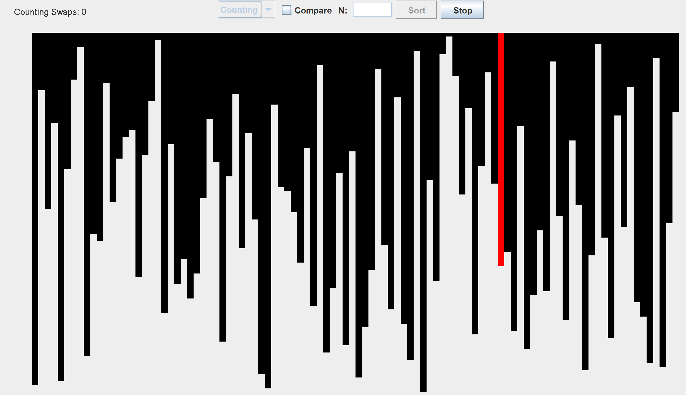

# Sorting-Algorithms
Java GUI that allows the user to specify the algorithm and the size of the array to sort. Can also compare each algorith by ticking the 'compare' box. This will keep the array the same for each algorithm and the user can see the differences in the amount of swaps, animations, and the amount of time taken.

## Instructions
Run window.java\
Choose the algorithm you want to see and click sort\
Change the size of array, by typing an number in text field\
Click stop if you want to\
Click compare if you want to keep arrays the same for each algorithm so you can compare\
For radix and counting sort, red bars means that element was accessed. I added this because otherwise, it wouldn’t be clear what the algorithm was doing, and it would just instantly sort the array.

## Counting Sort
Essentially counting sort takes in values to be sorted and count the occurrences in an auxiliary array with the index corresponding to the actual value. The size of the auxiliary depends on the range, or highest value of the array.\
For it to do that, it iterates through the array, (n), and fills up the auxiliary array with the number of occurrences of the values
Then, it loops through the auxiliary array, (range), and updates the array, essentially sorting it, using the count and the index of the auxiliary array.\
Thus, the time complexity is just O(n + range), with range being the range of the values in the array. For example, if the values are just from 1 – 100, the range/size of the auxiliary array is just 100.
 

